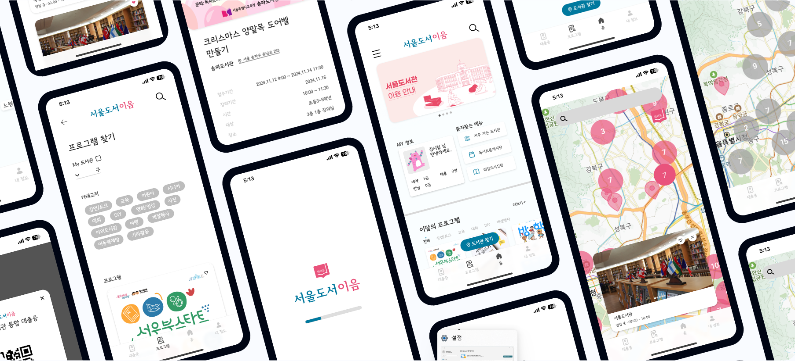
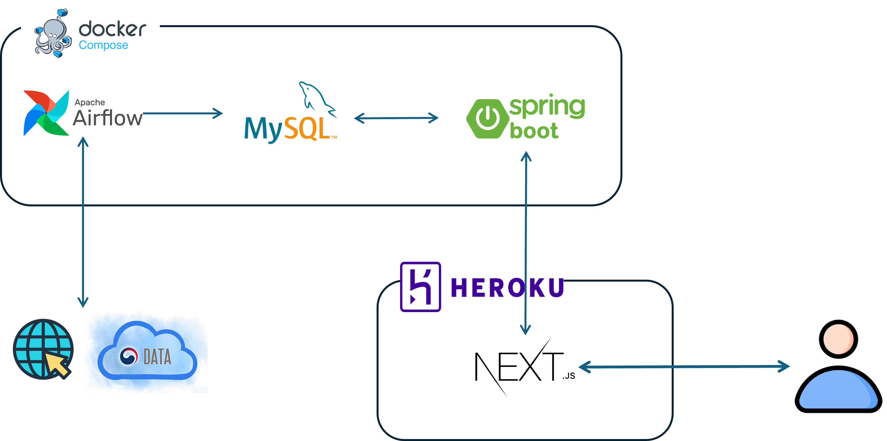

# Connect Seoul Book - 서울도서이음
This repository contains crawler and backend service of our project for UOS Hackathon 2024, Plankton.  
Frontend repository is [here](https://github.com/UOSHackathon2024/frontend).  
You can check the web service [here](https://uos-hackathon-static.vercel.app/).  
  
  
  
__Main purpose of the project__  
- Unify distributed information of libraries in Seoul, such as locations and it's features.
- Make a platform user-friendly and unified for searching event programs will be held in libraries in Seoul.
- Build system to recommend the event programs based on specific topics.  
  
__Functionalities of Service__  
- Find locations of libraries in Seoul
- Check locations of libraries which service ['책이음'](https://lib.seoul.go.kr/rwww/html/ko/bookeum.jsp).  
- Check event programs will be held in libraries in Seoul. 
- Get recommendation of the event programs based on specific topics.  
  

## Service Architecture
  

- Airflow crawling dags are defined in `crawler` 
- db structure is defined in `db_init/init_db.sql` 
- Backend service is defined in `backend` 
